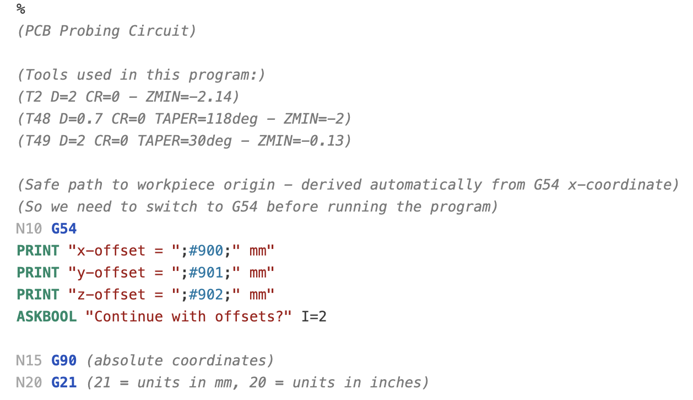
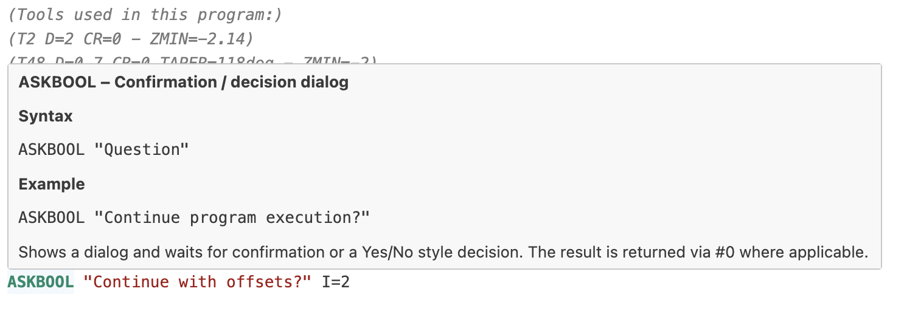
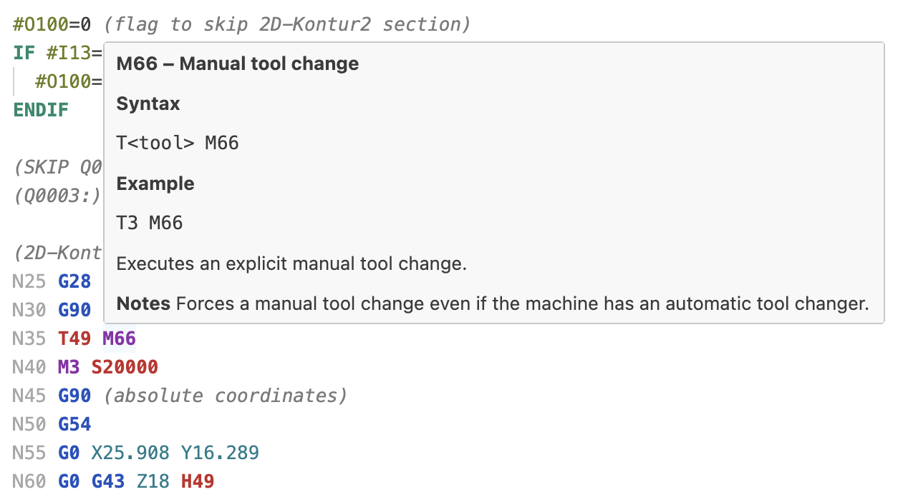

# GCODE-KineticNC

A VS Code extension providing language support for [KinetiC-NC](https://www.cnc-step.de/cnc-software/kinetic-nc-netzwerk-steuerungssoftware/)-specific CNC G-code. KinetiC-NC is CNC control software by [CNC-Step](https://www.cnc-step.de).

## Features

- Syntax highlighting for G-code and KinetiC-NC-specific commands
- Hover information for G-code and M-code commands

## Preview
<table align="center">
  <tr>
    <td>
      
    </td>
  </tr>
  <tr>
    <td align="center"><em>KinetiC-NC syntax highlighting in VS Code</em></td>
  </tr>
</table>

<table align="center">
  <tr>
    <td>
      
    </td>
  </tr>
  <tr>
    <td align="center"><em>Hover example 1</em></td>
  </tr>
</table>

<table align="center">
  <tr>
    <td>
      
    </td>
  </tr>
  <tr>
    <td align="center"><em>Hover example 2</em></td>
  </tr>
</table>

## Supported file extensions

- `.nc`
- `.cnc`
- `.gcode`

## Installation

Download the latest `.vsix` file from the [Releases](https://github.com/chiefenne/GCODE-KineticNC/releases) page and install it in VS Code.

### Option 1: VS Code UI

1. Open VS Code.
2. Go to Extensions (`Cmd+Shift+X` on macOS).
3. Click the `...` menu in the Extensions view.
4. Select `Install from VSIX...`.
5. Choose the provided `.vsix` file.

### Option 2: Command line

```bash
code --install-extension path/to/gcode-kineticnc-<version>.vsix
```

To upgrade, run the same command again with the newer `.vsix` file.

## Custom Token Colors (Optional)

To customize the highlighting colors beyond what your current theme provides, add the following to your VS Code user settings (`settings.json`):

```json
"editor.tokenColorCustomizations": {
  "textMateRules": [
    {
      "scope": [
        "comment.block.gcode-kineticnc",
        "comment.line.semicolon.gcode-kineticnc",
        "comment.block.preamble.gcode-kineticnc"
      ],
      "settings": {
        "foreground": "#7A7A7A",
        "fontStyle": "italic"
      }
    },
    {
      "scope": "variable.parameter.axis.gcode-kineticnc",
      "settings": {
        "foreground": "#0F7C8C"
      }
    },
    {
      "scope": "keyword.control.gcode-kineticnc",
      "settings": {
        "foreground": "#0F8A6A",
        "fontStyle": "bold"
      }
    },
    {
      "scope": "variable.parameter.machine.gcode-kineticnc",
      "settings": {
        "foreground": "#C62828",
        "fontStyle": "bold"
      }
    },
    {
      "scope": "variable.other.numeric.gcode-kineticnc",
      "settings": {
        "foreground": "#0077A6"
      }
    },
    {
      "scope": "variable.other.input.gcode-kineticnc",
      "settings": {
        "foreground": "#6B7D1F"
      }
    },
    {
      "scope": "variable.other.output.gcode-kineticnc",
      "settings": {
        "foreground": "#6B7D1F"
      }
    },
    {
      "scope": "support.function.gcode.gcode-kineticnc",
      "settings": {
        "foreground": "#1E4FBF",
        "fontStyle": "bold"
      }
    },
    {
      "scope": "support.function.mcode.gcode-kineticnc",
      "settings": {
        "foreground": "#8E2AA8",
        "fontStyle": "bold"
      }
    },
    {
      "scope": "constant.numeric.line-number.gcode-kineticnc",
      "settings": {
        "foreground": "#A8A8A8"
      }
    },
    {
      "scope": "entity.name.label.gcode-kineticnc",
      "settings": {
        "foreground": "#B42318"
      }
    }
  ]
}
```
