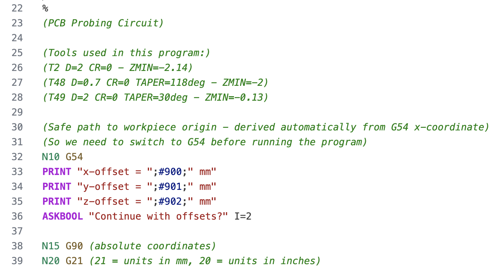

# GCODE-KineticNC

VS Code language support for KinetiC-NC G-code.

## Features

- Syntax highlighting of G-code and KinetiC-NC specific commands

## VS Code Highlighting Preview



Optional: add an animated preview to show hover/tooltips or scrolling:


### How This Preview Was Captured

Use this workflow when updating preview images:

1. Open a representative `.knc` or `.nc` file in VS Code.
2. Select a theme with clear token contrast (light or dark is fine, just keep it consistent).
3. Increase zoom one or two steps (`View: Zoom In`) so token colors are easy to read on GitHub.
4. Keep only the editor area visible (hide sidebars/panels if possible) for a clean screenshot.
5. Save the static preview as `assets/kineticnc-highlighting.png`.
6. Optional: record a short GIF as `assets/kineticnc-highlighting.gif` showing scrolling or hover behavior.

Recommended source snippet for the preview:

```gcode-kineticnc
%{
	(Job: sample contour)
	(MAT: Aluminium 5mm)
%}
N10 G90 G21
N20 G0 X0 Y0 Z5
N30 M3 S12000
N40 G1 Z-1.0 F200
N50 G1 X50 Y0 F800
N60 G1 X50 Y30
N70 G1 X0 Y30
N80 G1 X0 Y0
N90 G0 Z10
N100 M5
N110 M30
```

## Supported file extensions

- `.nc`
- `.cnc`
- `.gcode`

## Optional user token color customizations

If you want additional styling beyond the default syntax grammar, add this to your VS Code user settings (`settings.json`):

```json
"editor.tokenColorCustomizations": {
	"textMateRules": [
		{
			"scope": [
				"comment.block.gcode-kineticnc",
				"comment.line.semicolon.gcode-kineticnc",
				"comment.block.preamble.gcode-kineticnc"
			],
			"settings": {
				"fontStyle": "italic"
			}
		},
		{
			"scope": "keyword.control.gcode-kineticnc",
			"settings": {
				"fontStyle": "bold"
			}
		},
		{
			"scope": "entity.name.label.gcode-kineticnc",
			"settings": {
				"foreground": "#e91b1b",
				"fontStyle": "bold"
			}
		}
	]
}
```
